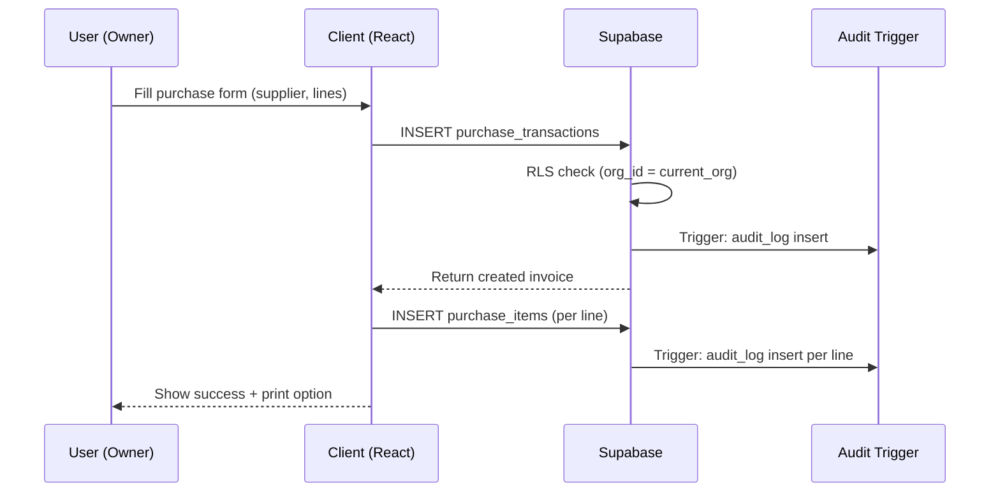
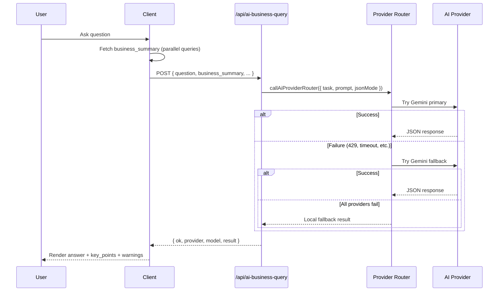
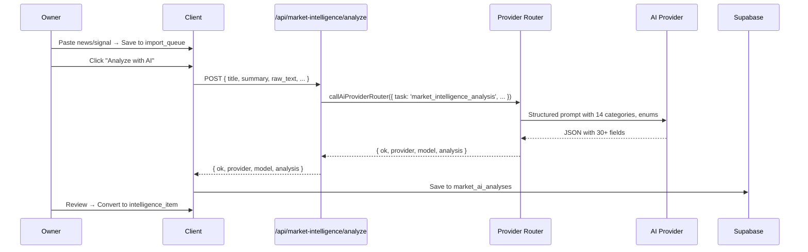

# OP OWNER — Architecture Documentation (Canonical Source)

> **This is the single authoritative document for system architecture. All other documents reference this.**

---

## System Architecture Overview

```
┌─────────────────────────────────────────────────────────────────────────────┐
│                            OP OWNER ARCHITECTURE                              │
├─────────────────────────────────────────────────────────────────────────────┤
│                                                                              │
│  ┌──────────────┐    ┌──────────────┐    ┌──────────────┐    ┌───────────┐  │
│  │   Browser    │    │   Browser    │    │   Browser    │    │  Mobile   │  │
│  │  (Owner)     │    │  (Staff)     │    │  (Customer)  │    │  (PWA)    │  │
│  └──────┬───────┘    └──────┬───────┘    └──────┬───────┘    └─────┬─────┘  │
│         │                   │                   │                   │         │
│         └───────────────────┼───────────────────┼───────────────────┘         │
│                             ▼                                                   │
│                    ┌──────────────────┐                                        │
│                    │   Vercel Edge    │                                        │
│                    │   (CDN, SSL,     │                                        │
│                    │    Headers)      │                                        │
│                    └────────┬─────────┘                                        │
│                             │                                                   │
│         ┌───────────────────┼───────────────────┐                               │
│         ▼                   ▼                   ▼                               │
│  ┌─────────────┐    ┌─────────────┐    ┌─────────────┐                        │
│  │  Next.js    │    │  Next.js    │    │  Next.js    │                        │
│  │  App Router │    │  API Routes │    │  Middleware │                        │
│  │  (RSC)      │    │  (Node.js)  │    │  (Auth)     │                        │
│  └──────┬──────┘    └──────┬──────┘    └──────┬──────┘                        │
│         │                  │                  │                                │
│         └──────────────────┼──────────────────┘                                │
│                            ▼                                                    │
│                 ┌─────────────────────┐                                        │
│                 │   Supabase          │                                        │
│                 │   (PostgreSQL)      │                                        │
│                 │   + Auth            │                                        │
│                 │   + Realtime        │                                        │
│                 │   + Storage         │                                        │
│                 │   + RLS             │                                        │
│                 └──────────┬──────────┘                                        │
│                            │                                                    │
│         ┌──────────────────┼──────────────────┐                                │
│         ▼                  ▼                  ▼                                │
│  ┌─────────────┐   ┌─────────────┐   ┌─────────────┐                          │
│  │  AI Router  │   │  External   │   │  External   │                          │
│  │  (4 Configured / 5 Supported) │  │  APIs       │  │  Services   │                          │
│  └─────────────┘   └─────────────┘   └─────────────┘                          │
│                                                                              │
└─────────────────────────────────────────────────────────────────────────────┘
```

---

## Frontend Architecture

### Next.js 16 App Router (React 19)

| Aspect | Implementation |
|--------|----------------|
| **Rendering** | Server Components by default (`layout.tsx`, section components) |
| **Client Boundaries** | `'use client'` only for: interactive state, browser APIs, event handlers |
| **Routing** | Single-page application at `/` with 27 conditional sections via `activeSection` state |
| **State Management** | React `useState` / `useReducer` at page level (planned: React Query / Zustand) |
| **Styling** | Tailwind CSS 4 (PostCSS), utility-first, responsive breakpoints |
| **PWA** | Manifest + icons configured; Service Worker (planned: Workbox) |
| **Code Splitting** | Dynamic imports for heavy sections (planned) |

### Page Structure (`src/app/page.tsx`)

```typescript
// Single-page architecture with 27 sections
const sections: SectionId[] = [
  'dashboard', 'products', 'brands', 'categories',
  'customers', 'suppliers', 'purchases', 'sales',
  'inventory', 'customer-payments', 'supplier-payments',
  'expenses', 'profit-loss', 'business-intelligence',
  'ai-analytics', 'customer-credit', 'supplier-ledger',
  'business-settings', 'task-manager', 'activity-logs',
  'staff-permissions', 'security-check', 'deployment',
  'staff-duty', 'ai-assistant', 'ai-business-query',
  'ai-voice-operator', 'market-intelligence', 'mobile-app'
];

// Each section conditionally rendered:
// {activeSectionAllowed && activeSection === 'id' && (<Section />)}
```

**Trade-offs:**
- ✅ Simple deployment, no routing complexity, instant section switching
- ⚠️ Large bundle (~2MB JS), all state in one component
- 🔮 **Planned**: Route groups (`/dashboard`, `/products`, `/ai/*`) with dynamic imports

---

## Backend Architecture

### API Routes (Node.js Runtime)

All routes in `src/app/api/*/route.ts` with `export const runtime = 'nodejs'`.

| Route | Purpose | Auth | Validation |
|-------|---------|------|------------|
| `/api/ai-business-query` | Natural language business Q&A | Supabase JWT | Manual (planned: Zod) |
| `/api/market-intelligence/analyze` | Market signal impact analysis | Supabase JWT | Manual (planned: Zod) |
| `/api/ai-voice-operator/*` | Voice session management | Supabase JWT | Planned |
| `/api/ai-action-drafts/*` | Action draft CRUD + execution | Supabase JWT | Planned |

### Server Actions (Planned)

Replace client-side Supabase mutations with Server Actions:

```typescript
// src/app/actions/purchases.ts
'use server';
import { createServerClient } from '@/lib/supabase/server';
import { PurchaseSchema } from '@/lib/validators';

export async function createPurchase(data: unknown) {
  const supabase = createServerClient();
  const { data: { user } } = await supabase.auth.getUser();
  const validated = PurchaseSchema.parse(data);
  
  // RLS enforces organization_id
  const { data, error } = await supabase
    .from('purchase_transactions')
    .insert({ ...validated, organization_id: user.org_id })
    .select()
    .single();
  
  if (error) throw new Error(error.message);
  return data;
}
```

---

## Supabase Architecture

### Database Design Principles

| Principle | Implementation |
|-----------|----------------|
| **Multi-tenancy** | Every table has `organization_id` (UUID, FK → organizations) |
| **RLS Enforcement** | All policies: `USING (organization_id = current_org_id())` |
| **Audit Trail** | `audit_logs` table + triggers on all mutable tables |
| **Soft Deletes** | `status` field (active/archived/cancelled) instead of DELETE |
| **Referential Integrity** | FKs on all relationships, CASCADE where appropriate |

### Key Tables Schema

```sql
-- Core hierarchy
organizations (id, name, created_at)
  │
  ├── profiles (id, organization_id, email, role, is_active, display_name, auth_user_id)
  │     │
  │     └── staff_permissions (organization_id, profile_id, 11 boolean permissions)
  │
  ├── products (id, organization_id, name, brand_id, category_id, unit_type,
  │              last_purchase_price, default_selling_price, minimum_stock_level,
  │              reorder_level, track_batch, track_expiry)
  │
  ├── brands (id, organization_id, name)
  │
  ├── categories (id, organization_id, name, parent_category_id)
  │
  ├── customers (id, organization_id, customer_name, shop_name, phone, whatsapp,
  │               city, area, customer_type, credit_policy, credit_limit,
  │               credit_days, allow_over_limit, allow_overdue_sales,
  │               preferred_payment_method)
  │
  ├── suppliers (id, organization_id, supplier_name, contact_person, phone,
  │               whatsapp, city, notes)
  │
  ├── purchase_transactions (id, organization_id, supplier_id, invoice_number,
  │                           created_at, purchase_date, expense_review_status,
  │                           expense_reviewed_at)
  │     └── purchase_items (id, purchase_transaction_id, product_id, quantity,
  │                          purchase_price, selling_price, batch_number, expiry_date)
  │
  ├── sales_transactions (id, organization_id, customer_id, invoice_number,
  │                        created_at, sale_date, payment_type, credit_due_date,
  │                        credit_limit_snapshot, credit_days_snapshot)
  │     └── sales_items (id, sales_transaction_id, product_id, quantity,
  │                       selling_price, batch_number, expiry_date)
  │
  ├── customer_payments / supplier_payments (header)
  │     └── payment_allocations (invoice linking)
  │
  ├── expenses (id, organization_id, category, amount, date, description,
  │              purchase_transaction_id)
  │
  └── audit_logs (id, organization_id, actor_profile_id, actor_email, action,
                   entity_type, entity_id, entity_label, description,
                   old_values, new_values, created_at)

-- AI Tables
ai_business_query_logs, market_import_queue, market_intelligence_items,
market_ai_analyses, ai_voice_operator_sessions, ai_voice_operator_messages,
ai_action_drafts, ai_action_messages, ai_alerts, ai_daily_briefings

-- Security
security_checks

-- Mobile/GPS
staff_duty_sessions, staff_location_points
```

### RLS Policy Pattern

```sql
-- Enable RLS
ALTER TABLE products ENABLE ROW LEVEL SECURITY;

-- Helper function
CREATE OR REPLACE FUNCTION current_org_id()
RETURNS uuid LANGUAGE sql STABLE AS $$
  SELECT auth.jwt() ->> 'organization_id'::uuid;
$$;

-- Read policy
CREATE POLICY "org_read" ON products
  FOR SELECT USING (organization_id = current_org_id());

-- Write policy (permission-gated)
CREATE POLICY "org_write" ON products
  FOR INSERT WITH CHECK (
    organization_id = current_org_id() AND
    EXISTS (
      SELECT 1 FROM staff_permissions sp
      JOIN profiles p ON p.id = sp.profile_id
      WHERE p.auth_user_id = auth.uid()
      AND sp.can_manage_products = true
    )
  );
```

### Supabase Features Used

| Feature | Usage |
|---------|-------|
| **Auth** | Email/password, JWT with `organization_id` custom claim |
| **Database** | PostgreSQL 15+, all business tables |
| **RLS** | Primary authorization layer |
| **Realtime** | Planned: live dashboard, staff location updates |
| **Storage** | Planned: invoice PDFs, product images, voice recordings |
| **Edge Functions** | Planned: AI processing, webhooks, scheduled jobs |
| **PgBouncer** | Connection pooling (managed, 100 connections) |

---

## AI Layer Architecture

### Provider Router (`src/lib/ai/provider-router.ts`)

```typescript
// Core interface
type AiProviderName = 'gemini' | 'openai' | 'groq' | 'xai' | 'zai';

async function callAiProviderRouter(input: RouterInput): Promise<RouterResult> {
  // 1. Determine provider order from env
  const order = providerOrder(); // e.g., ['gemini', 'openai', 'xai', 'zai']
  
  // 2. For each provider, get available models
  for (const provider of order) {
    const models = getModelsForProvider(provider);
    
    // 3. For each model, try with retries
    for (const model of models) {
      for (let attempt = 0; attempt <= maxRetries(); attempt++) {
        const result = await callProvider(provider, model, ...);
        
        if (result.ok) {
          // 4. Validate JSON if jsonMode
          if (jsonMode && !isValidJson(result.text)) continue;
          return { ok: true, provider, model, ... };
        }
        
        // 5. Fallback on retryable status codes
        if (!fallbackStatuses.has(result.status)) break;
      }
    }
  }
  
  // 6. Local fallback if enabled
  if (localFallbackEnabled()) return localFallback(input);
  
  return { ok: false, attempts, error: 'All providers failed' };
}
```

### Provider Configuration

| Provider | API Style | Primary Model (from env) | Fallback Model (from env) | Env Vars | In Configured Order |
|----------|-----------|--------------------------|---------------------------|----------|---------------------|
| **Gemini** | Native `generateContent` | `gemini-flash-latest` | `gemini-3.1-flash-lite` | `GEMINI_API_KEY`, `GEMINI_PRIMARY_MODEL`, `GEMINI_FALLBACK_MODEL` | ✅ 1st |
| **OpenAI** | Responses API | `gpt-5.4-mini` | `gpt-5.4-nano` | `OPENAI_API_KEY`, `OPENAI_PRIMARY_MODEL`, `OPENAI_FALLBACK_MODEL` | ✅ 2nd |
| **xAI/Grok** | Chat Completions | `grok-4.5` | `grok-4.5` | `XAI_API_KEY`, `XAI_PRIMARY_MODEL`, `XAI_FALLBACK_MODEL` | ✅ 3rd |
| **Groq** | Chat Completions | `llama-3.3-70b-versatile` | `llama-3.1-8b-instant` | `GROQ_API_KEY`, `GROQ_PRIMARY_MODEL`, `GROQ_FALLBACK_MODEL` | ❌ Supported but not in configured order |
| **Z.ai/GLM** | Chat Completions (custom endpoint) | `GLM-5.2` | `GLM-4.5-Air` | `ZAI_API_KEY`, `ZAI_BASE_URL`, `ZAI_PRIMARY_MODEL`, `ZAI_FALLBACK_MODEL` | ✅ 4th |

### Router Configuration (Environment)

```env
AI_PROVIDER_ORDER=gemini,openai,xai,zai
AI_MAX_RETRIES_PER_PROVIDER=1
AI_PROVIDER_TIMEOUT_MS=20000
AI_ENABLE_LOCAL_FALLBACK=true
```

**Note**: Default code order is `gemini,openai,groq` but `.env.local` overrides to `gemini,openai,xai,zai` (Groq is supported but not in configured order).

### Fallback Triggers
- HTTP 429, 404, 500, 502, 503, 504
- Timeout (20s default)
- Empty response
- JSON parse failure

### Local Fallback
When all providers fail, deterministic summary generated from `business_summary`:
- Sales/Purchases/Payments/Expenses totals and counts
- Task status breakdown
- Inventory alerts (low/out of stock)
- Market intelligence alerts (critical/high)

### AI API Endpoints

#### 1. Business Query (`/api/ai-business-query`)
```
POST { question, language, query_type, date_range_start, date_range_end, business_summary }
→ { ok, provider, model, result: { answer, query_type, language, key_points[], warnings[] } }
```
**Two Modes:**
- `query_type: 'analytics_explainer'` → Structured: Summary, Evidence, Recommendations, Confidence
- `query_type: 'general'` → Practical owner answer

#### 2. Market Intelligence (`/api/market-intelligence/analyze`)
```
POST { title, summary, raw_text, source_name, source_url, market_category, context_country, business_context }
→ { ok, provider, model, analysis: { 30+ fields including threat_detection[], opportunity_detection[], risk_score, opportunity_score, urgency, suggested_owner_actions[], business_health_impact, executive_summary, why_it_matters } }
```

---

## Voice Layer Architecture (Planned)

### Components

| Component | Technology | Status |
|-----------|------------|--------|
| **Wake Word** | Porcupine / custom "OP OWNER" | Planned |
| **STT** | Web Speech API → Whisper API → Gemini Live | Planned |
| **Intent Classifier** | Router LLM (same provider chain) | Schema ready |
| **Dialog Manager** | State machine over `ai_voice_operator_messages` | Schema ready |
| **TTS** | Web Speech API → ElevenLabs → Gemini TTS | Planned |
| **Mobile Integration** | PWA + `beforeinstallprompt` + mic permission | Planned |

### Data Model

```sql
ai_voice_operator_sessions (
  id, organization_id, profile_id, session_title, language,
  started_at, ended_at, status, created_at, updated_at
)

ai_voice_operator_messages (
  id, organization_id, profile_id, voice_session_id,
  role, message_type, message_text, detected_intent, routed_to,
  related_ai_action_draft_id, related_business_query_log_id,
  related_market_ai_analysis_id, created_at
)
```

### Flow

```
User: "OP OWNER" (wake word)
  → STT starts
User: "Create purchase for 10 cartons Pepsi from Test Agency at 1000 buy 1200 sell"
  → STT → text
  → Intent: "command" → routed_to: "action_draft"
  → Create ai_action_draft (status: draft, parsed_data: {...})
  → TTS: "I've drafted a purchase for 10 cartons of Pepsi from Test Agency at 1000 purchase, 1200 selling. Confirm?"
User: "Yes"
  → Intent: "confirmation" → execute draft → audit log
  → TTS: "Purchase invoice created. Invoice number PUR-2026-001."
```

---

## Market Intelligence Architecture

### Ingestion Pipeline

```
┌─────────────┐    ┌──────────────────┐    ┌─────────────────┐    ┌────────────────────┐
│  Sources    │───▶│  Import Queue    │───▶│  AI Analysis    │───▶│  Intelligence      │
│  (RSS, API, │    │  (market_import_ │    │  (/api/market-  │    │  Items             │
│   Manual)   │    │   queue_item)    │    │   intelligence/ │    │  (market_intelli-  │
└─────────────┘    └──────────────────┘    │   analyze)      │    │   gence_item)      │
                                             └─────────────────┘    └────────────────────┘
                                                   │
                                                   ▼
                                         ┌─────────────────┐
                                         │  ai_analyses    │
                                         │  (market_ai_    │
                                         │   analyses)     │
                                         └─────────────────┘
```

### Analysis Categories (14 Fixed)

| Category | Code | Examples |
|----------|------|----------|
| Cooking Oil & Ghee | `cooking_oil_ghee` | Import duty, palm oil price, ghee shortage |
| Sugar | `sugar` | Cane crushing, export quota, mill prices |
| Wheat Flour | `wheat_flour` | Wheat support price, flour mill rates |
| Rice | `rice` | Basmati/IRRI rates, export demand |
| Pulses | `pulses` | Chana, moong, masoor imports |
| Spices | `spices` | Red chilli, turmeric, cumin crop |
| Beverages | `beverages` | Soft drinks, juices, water |
| Dairy | `dairy` | Milk powder, UHT, butter |
| Fuel & Transport | `fuel_transport` | Petrol/diesel price, freight rates |
| Packaging | `packaging` | PET, cartons, BOPP film prices |
| Currency & Imports | `currency_imports` | USD/PKR, LC margins, customs duty |
| Taxes & Policy | `taxes_policy` | GST, FBR SROs, Punjab Food Authority |
| Weather & Agriculture | `weather_agriculture` | Monsoon, frost, locust, crop estimates |
| General FMCG | `general_fmcg` | Consumer sentiment, retail trends |

### Output Schema (30+ Fields)

```typescript
interface AnalysisResult {
  // Core classification
  market_category: MarketCategory;
  impact_direction: ImpactDirection;
  impact_level: ImpactLevel;
  confidence_level: ConfidenceLevel;
  affected_area: AffectedArea;
  
  // Narrative
  summary: string;
  reasoning: string;
  suggested_action: string;
  risks: string;
  owner_questions: string;
  
  // Business impact
  executive_summary: string;
  business_impact: string;
  risk_score: number;        // 0-100
  opportunity_score: number; // 0-100
  urgency: UrgencyLevel;
  confidence: 'High' | 'Medium' | 'Low';
  affected_business_areas: BusinessImpactArea[];
  affected_products: string[];
  affected_categories: string[];
  
  // Detection
  threat_detection: ThreatType[];
  opportunity_detection: OpportunityType[];
  suggested_owner_actions: ActionType[];
  
  // Health
  business_health_impact: HealthImpact;
  business_health_reason: string;
  why_it_matters: string;
}
```

---

## Business Intelligence Architecture

### Current (v1.0)

| Component | Implementation |
|-----------|----------------|
| **Dashboard KPIs** | Client-side aggregation from Supabase queries |
| **P&L** | Period queries on `sales_transactions`, `purchase_transactions`, `expenses` |
| **Customer Credit** | Aging calculation in TypeScript from payment allocations |
| **Supplier Ledger** | Running balance computed client-side from purchases + payments |

### Planned (v1.1+)

| Component | Technology |
|-----------|------------|
| **Materialized Views** | `dashboard_kpis`, `monthly_pl`, `customer_aging`, `supplier_aging` refreshed via pg_cron |
| **Analytics API** | `/api/business-intelligence/*` with cached responses |
| **AI Analytics** | Scheduled daily briefing via Edge Function + Provider Router |
| **Anomaly Detection** | Statistical (z-score) + LLM interpretation |
| **Forecasting** | Prophet/LightGBM on sales velocity → reorder suggestions |

---

## Future Mobile Architecture

### PWA (Current Target)

| Capability | Implementation |
|------------|----------------|
| **Install** | Manifest + `beforeinstallprompt` handler |
| **Offline** | Service Worker (Workbox) → cache shell + critical data |
| **Sync** | IndexedDB queue → Background Sync API → Supabase on reconnect |
| **Push** | Web Push (VAPID) → Supabase Realtime → FCM/APNs |
| **Camera** | `getUserMedia` + Barcode Detection API / QuaggaJS |
| **Location** | Geolocation API (Staff Duty) |
| **Voice** | Web Speech API + Wake Word |

### Native Wrapper (Future)

```
┌─────────────────────────────────────┐
│         Capacitor / Tauri           │
├─────────────────────────────────────┤
│  Web View (Next.js PWA)             │
│  + Native Plugins:                  │
│    - Background Geolocation         │
│    - Bluetooth LE (scanners)        │
│    - Biometric Auth                 │
│    - Local Notifications            │
│    - File System (PDF invoices)     │
│    - Share Sheet (WhatsApp)         │
└─────────────────────────────────────┘
```

---

## Data Flow Diagrams

### 1. Purchase Creation Flow



### 2. AI Business Query Flow



### 3. Market Intelligence Analysis Flow



---

## Security Architecture

> **See [SECURITY.md](SECURITY.md) for complete security model.**

### Authentication Flow

```
User → Supabase Auth (email/password)
       ↓
JWT with custom claim: { organization_id: "uuid", role: "owner" }
       ↓
Client stores session in localStorage (Supabase client)
       ↓
All Supabase requests: Authorization: Bearer <jwt>
       ↓
PostgreSQL: current_org_id() = auth.jwt() ->> 'organization_id'
       ↓
RLS policies enforce organization isolation
```

### Secrets Management

| Secret | Storage | Rotation |
|--------|---------|----------|
| Supabase Anon Key | `.env.local` → Vercel Env | Quarterly |
| Supabase Service Role | Vercel Env (server only) | Quarterly |
| AI Provider Keys | Vercel Env (server only) | Quarterly |
| Web Push VAPID | Vercel Env | Annual |

### API Security Layers

| Layer | Mechanism |
|-------|-----------|
| **Transport** | HTTPS everywhere (Vercel managed) |
| **Auth** | Supabase JWT on every request |
| **Authorization** | RLS + Server Action permission checks |
| **Rate Limiting** | Planned: Upstash Ratelimit on `/api/*` |
| **Input Validation** | Planned: Zod schemas on all API routes |
| **CSP** | Planned: `next.config.ts` headers |
| **Audit** | Immutable `audit_logs` on all mutations |

---

## Observability (Planned)

| Signal | Tool | Implementation |
|--------|------|----------------|
| **Logs** | Vercel Logs / Datadog | Structured JSON, correlation IDs |
| **Metrics** | Prometheus / Vercel Analytics | API latency, AI provider success rates, error rates |
| **Traces** | OpenTelemetry → Jaeger | End-to-end: API → Provider Router → AI |
| **Alerts** | PagerDuty / Opsgenie | AI fallback rate > 10%, API p99 > 10s, RLS errors |
| **AI Evals** | Langfuse / Custom | Golden dataset accuracy, hallucination rate |

---

## Deployment Architecture

### Vercel (Current)

```
GitHub (main) → Vercel Build → Edge Network
                    │
                    ├── next build (Turbopack)
                    ├── TypeScript check
                    ├── ESLint
                    └── Static generation (6 pages)
```

### Environment Variables (Vercel)

| Variable | Scope | Description |
|----------|-------|-------------|
| `NEXT_PUBLIC_SUPABASE_URL` | Build + Runtime | Supabase project URL |
| `NEXT_PUBLIC_SUPABASE_ANON_KEY` | Build + Runtime | Public anon key |
| `GEMINI_API_KEY` | Runtime (Server) | Google AI Studio key |
| `OPENAI_API_KEY` | Runtime (Server) | OpenAI API key |
| `XAI_API_KEY` | Runtime (Server) | xAI API key |
| `GROQ_API_KEY` | Runtime (Server) | Groq API key |
| `ZAI_API_KEY` | Runtime (Server) | Z.ai API key |
| `ZAI_BASE_URL` | Runtime (Server) | Z.ai endpoint |
| `AI_PROVIDER_ORDER` | Runtime (Server) | Fallback priority |
| `AI_MAX_RETRIES_PER_PROVIDER` | Runtime (Server) | Retry count |
| `AI_PROVIDER_TIMEOUT_MS` | Runtime (Server) | Timeout |
| `AI_ENABLE_LOCAL_FALLBACK` | Runtime (Server) | Enable local summary |

---

## Scaling Considerations

| Bottleneck | Current Limit | Mitigation |
|------------|---------------|------------|
| **Single-page bundle** | ~2MB JS | Code splitting, route groups |
| **Client-side queries** | N+1 problems | React Query, server components |
| **AI provider latency** | 20s timeout | Streaming, hedging, caching |
| **Supabase connections** | 100 (PgBouncer) | Connection pooling, read replicas |
| **Audit log growth** | Unbounded | Partitioning by month, TTL |
| **Market intelligence queue** | Manual only | Automated ingestion, dedup |

---

## Technology Decisions Log

| Decision | Date | Context | Alternatives Considered |
|----------|------|---------|-------------------------|
| Next.js App Router | 2024 | React 19, RSC, Turbopack | Pages Router, Remix |
| Supabase + RLS | 2024 | Auth + DB + Realtime + RLS in one | Custom Node + PostgreSQL, Firebase |
| Single-page SPA | 2024 | Owner sees everything, no routing complexity | Multi-page, route groups |
| 5 AI Providers | 2024 | Resilience, cost, model diversity | Single provider (OpenAI), 2 providers |
| Local AI Fallback | 2024 | Business continuity during outages | None (fail hard) |
| Tailwind CSS 4 | 2024 | Performance, no config, modern CSS | CSS Modules, Styled Components |
| TypeScript Strict | 2024 | Catch bugs at compile time | Loose TS, JSDoc |
| PWA over Native | 2024 | Reach, update speed, cost | React Native, Flutter, Capacitor |

---

## Future Architecture Evolution

```
CURRENT (v1.0)                    v1.5                        v2.0+
─────────────────                 ──────                      ─────
Single Next.js App                Next.js + Edge Functions    Next.js + Microservices
  │                                   │                          │
  ├── /api/ai-*                     ├── /api/ai/* (Edge)        ├── ai-service (Python/FastAPI)
  ├── /api/market-*                 ├── /api/market/* (Edge)    ├── market-service
  └── Supabase                      └── Supabase + Redis        ├── notification-service
                                                                    ├── analytics-service
                                                                    └── Supabase (data only)
```

---

**Document Version**: 1.0  
**Last Review**: 2026-07-15  
**Next Review**: 2026-10-15  
**Owner**: OP OWNER Architecture Team